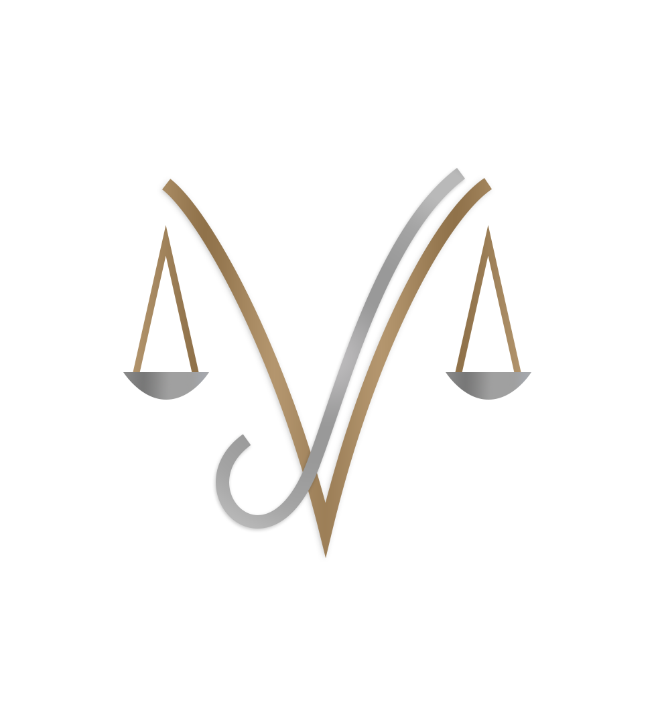

####  English (Eng)

#  Julio Vieira - Law Firm 

A website for a Law Firm, developed to study design, responsiveness and Javascript fundamentals.
When i started the creation of this website i dont mind it will be this hard to me, but i've spent too many days thinking about `sizes, fonts and colors` just to create the design.
I've never created such a serious website before, and it needs to be serious because it's a law website, so I need to think in straight lines, like squares and triangles, and it is hard for me.

## Used technologies

 
  
  
  
  
  
  

## How did I do that!? Check the step-by-step process below.

* Create Logo and the full design with Photoshop and Figma, also used some books to understand concepts.
* Build the entire page using semanthyc HTML.
* Build the entire CSS using SASS (Not responsive).
* Write the JavaScript codes, and change softly the CSS/HTML when its needed.
* Add scroll effects on CSS with the help of Javascript.
* Add responsiveness on CSS.
* Validate the form inputs.

## Difficulties

The most difficulty thing that i have created at this project was the `<form>`, since the design to the code, because it has a flag, a logo, differents backgrounds and these items are deliberately overlapping.
Make the form real and responsive using only SASS and HTML was pretty hard, but it lead me to learn a lot of cool things about CSS,
like using `::after` to create the beige background and also using box-shadow to make the shadows.

## Links
You can find me in the links below ⬇️

   
   
   

Here you can check the website

####  Português (Pt-BR)

#  Julio Vieira - Escritório de Advocacia 

## Um website para um escritório de advocacia, desenvolvido para estudar design, responsividade e efeitos com Javascript/CSS.
## Tecnologias utilizadas

 
  
  
  
  

## Dificuldades
Certamente a coisa mais difícil que eu fiz nesse projeto foi a construção do `<form>`, porque nele contém uma bandeira, uma logo, diferentes planos de fundo e esses itens são propositalmente sobrepostos. 
Tornar o formulário real e responsivo usando apenas SASS e HTML foi bem desafiador, mas isso me fez aprender diversas coisas novas e interessantes sobre o CSS,
como usar o `::after` para criar o background bege, além de usar `box-shadow` para fazer as sombras.

## Links

   
   
   

